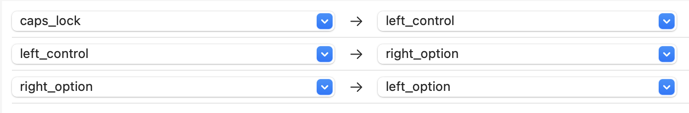
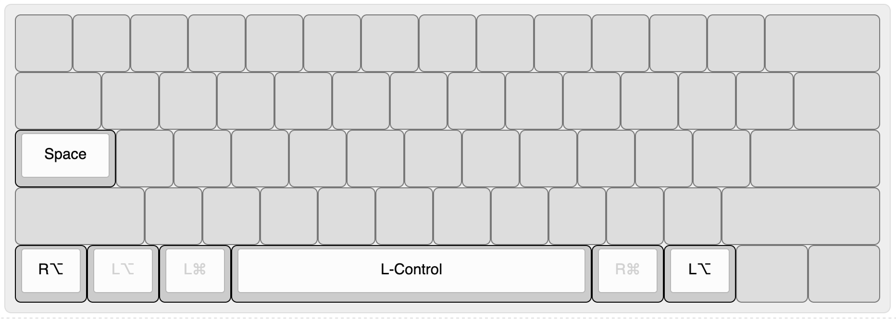
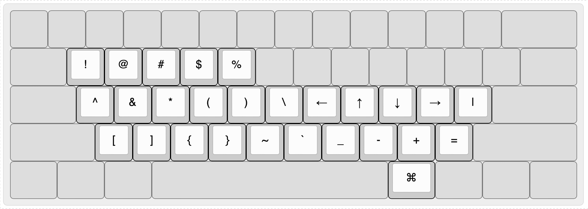
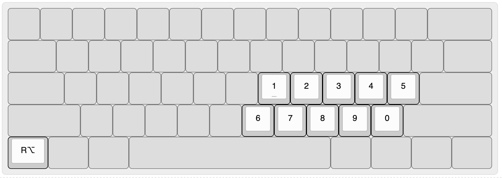

## Simple Modifications

R-option is assigned to the bottom-left key to make it easier to switch layers, while L-option is assigned to the original option position on both the left and the right.

### Result

With simple modifications and a complex modification named `Swap Space and L-Ctrl`, modification keys look like below.

---

## Layers

With the all complex modifications, these layers will be available.

### Right Command Layer

### Right Option Layer

---

## Assets

Note that the R-option is assigned to the bottom-left key using simple modifications.

- `assets/json/***.json` files can be viewed and modified at https://www.keyboard-layout-editor.com/
